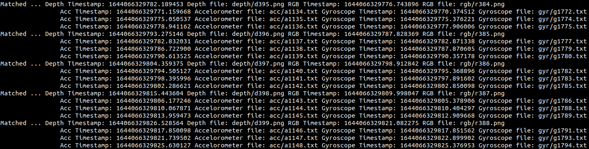

# RealsenseRecord

[](https://travis-ci.org/anfederico/Clairvoyant)


## About
The RealsenseRecord project provides tools for acquiring, recording and synchronizing the RGB, Depth, Gyroscope and Accelerometer measurements from Intel Realsense cameras.
## [Installation](#Installation)
Use the following steps to download and compile the project:
```bash
# Clone the repository
git clone http://git.ehourdakis.com/RealsenseRecord
```
***
**If you are looking for a quick way to record data, then you can skip to the [Calibration of the RGB and Depth sensors](#CalibratingRGBD) section, for instructions on how to calibrate the camera, and then to the [Docker](#Docker) section, for instructions on how to run a pre-compiled version of the application, to record data seamlessly.**
***
Use the script **setup.sh** in the **scipts/installation** directory, to install the project's dependencies. After setting all up, configure and compile the project, by specifying your OpenCV4 and RealsenseSDK installation folders: 
```bash
# Create build directories
cd RealsenseRecord/
mkdir build && cd build

# Generate using cmake, by specifying the directories of your local OpenCV4 and RealsenseSDK installation
cmake -DOpenCV_DIR:STRING="$OPENCV_INSTALL"/lib/cmake/opencv4/          \
      -Drealsense2_DIR:STRING="$REALSENSE_INSTALL"/lib/cmake/realsense2 ..

# Compile 
make -j4
```
This process will create two different executables, described  below:
| Application | Description  |
| ------ | -----------  |
| rs_pipeline_group_frame  | Retrieve RGB and Depth frames using the framesets posted by the device, and store them as groups of RGB, Depth, and multiple paired accelerometer and gyroscope measurements. Frame association is performed online, within the device callback. |
| rs_async_drop_RGBDIMU  | Drop the data frames from the device callback directly to memory, and index them based on the selected timestamping method. To keep the recording framerate high, this recorder does not perform any frame association routines, but dumps the data asynchronously as they come. | 

**Recording a data sequence:** To record a data sequence execute the *rs_async_drop_RGBDIMU* recorder, and save all measurements under a directory. Then synchronize the data frames based on their timestamps, as described in the section [Synchronization](#Synchronization).
***

To record a dataset, simply execute the following command:
```bash
# Record 300 frames with 60 FPS in the home/datadir/ directory
./rs_async_drop_RGBDIMU "/home/datadir/" 60 300 
```
The program will acquire the data from the different camera streams and store them in the directory specified in the first argument. The directory structure of the dataset has the following form:
```
datadir
├── rgb
│   ├── **/*.png
├── depth
│   ├── **/*.png
├── acc
│   ├── **/*.txt
├── gyr
│   ├── **/*.txt
├── rgb.txt
├── depth.txt
├── acc.txt
├── gyr.txt
├── rgb.intrinsics
```
The **rgb/** and **depth/** directories hold the corresponding RGB and Depth images in a .png format. The **acc/** and **gyr/** directories hold the accelerometer and gyroscope measurements as a 3D vector, stored in a .txt file. The files are indexed by order of first appearance.

The files **rgb.txt**, **depth.txt**, **acc.txt** and **gyr.txt** store the timestamp and the index of each data frame. Finally, the file **rgb.intrinsics** holds the intrinsic parameters of the RGB device, as a 3x3 matrix stored in a text format. 

## [Synchronization](#Synchronization)

The aforementioned data are indexed directly, while being acquired asynchronously by the device callback. To compensate for this we must post-process the data, in order to associate the frames from different sensor streams, based on their timestamps. The directory **scripts/postprocess** includes scripts to make this synchronization. To syncrhonize the RGB, Depth, Gyroscope and Accelerometer data frames, run the following script:
```bash
# Synchronize timestamps
python scripts/postprocess/assoc_rgbdi.py depth.txt rgb.txt acc.txt gyr.txt
```

*NOTE: If the proper paths are installed using the **setup.sh** script in the **scripts/installation** folder, then you can simply navigate to a data directory, and run **associate.sh**, to synchronize the data.* 

This will generate the following new directory and file indexes:
```
├── imu
│   ├── **/*.csv
├── rgb_aligned.txt
├── depth_aligned.txt
├── imu_aligned.txt
```
The new **rgb_aligned.txt**, **depth_aligned.txt**, **imu_aligned.txt** files store the synchronized indexes. The new **imu/** folder includes the associated accelerometer and gyroscope measurements, as a 6-dimensional vector stored in a .csv file.

The figure below shows the typical program output, that couts the matched sets of Depth, RGB + multiple accelerometer, gyroscope measurements:



*NOTE:* While recording, the only computational intensive operation that we execute, is aligning the RGB image to the Depth image. Even though applying additional filters can improve the quality of data acquisition, adding too many will affect the frame rate of the camera. 

To remove possible lags during data acquisition, we index all data using their timestamp, and dump them to the disk after recording finishes.

## Intel realsense cameras and timestamps
The realsense cameras support [four different types of timestamps](https://intelrealsense.github.io/librealsense/doxygen/classrs2_1_1frame.html):
| Timestamp Type | Description  |
| ------ | -----------  |
|SENSOR_TIMESTAMP | Device clock. For video sensors designates the middle of exposure.  |
|FRAME_TIMESTAMP | Device clock. Stamped at the beginning of frame readout and transfer. |
|BACKEND_TIMESTAMP | Host (EPOCH) clock in Kernel space. Frame transfer from USB Controller to the USB Driver. |
|TIME_OF_ARRIVAL | Host (EPOCH) clock in User space. Frame transfer from the USB Driver to Librealsense.|

To enable the first two types we must set the CMake flag ENFORCE_METADATA to true, when building the realsense SDK (it is set to False by default). Alternatively, you can use the script **install_realsenseSDK.sh** in the **scripts/installation**, which includes the appropriate flags in its configuration.

Below is the default behavior on timestamping, as described in the Intel documentation:

*The function call provides the TIME_OF_ARRIVAL stamp. In case the metadata is available the function returns:
HW Timestamp (FRAME_TIMESTAMP), or
Global Timestamp Host-corrected derivative of HW Timestamp required for multi-sensor/device synchronization
The user can select between the unmodified and the host-calculated Hardware Timestamp by toggling the RS2_OPTION_GLOBAL_TIME_ENABLED option.*

A more detailed discussion on timestamping and the IMU frames can be found [here](https://www.intelrealsense.com/how-to-getting-imu-data-from-d435i-and-t265/). In summary, IMU frames are timestamped according the rule below:

*Each IMU data packet is timestamped using the depth sensor hardware clock to allow temporal synchronization between gyro, accel and depth frames.*
## [Calibration of the RGB and Depth sensors](#CalibratingRGBD)
**Calibration of the depth sensor** can improve depth precision and correct “intrinsic” or “extrinsic” distortions. It can be run from the GUI of the realsense-viewer, using the process described in the following [link](https://dev.intelrealsense.com/docs/self-calibration-for-depth-cameras). You can read more on the projection model in Realsense SDK 2.0 [here](https://github.com/IntelRealSense/librealsense/wiki/Projection-in-RealSense-SDK-2.0#distortion-models).

**Calibration of the RGB sensor** can be accomplished using the Intel Dynamic Calibration Tool, which can be installed by executing the script **scripts/installation/install_realsense_calibrationtool.sh**. After calibration, the data are stored on chip, and can be accessed by the SDK. A complete guide describing the process can be found here: [Calibration use guide](https://dev.intelrealsense.com/docs/intel-realsensetm-d400-series-calibration-tools-user-guide). 
To retrieve the calibration data stored in the device by a previous calibration, execute the script **scripts/postprocess/store_calibration.sh**, by passing the width and height of the camera resolution:
```bash
source scripts/postprocess/store_calibration.sh 1280 720
```
In [this document](https://www.intelrealsense.com/wp-content/uploads/2020/06/Intel-RealSense-D400-Series-Datasheet-June-2020.pdf) you can access information about the camera's baseline and other sensor parameters. 
## RGB Distortion
Intel D455 uses the Inverse Brown Conrady distortion model ([link](
https://github.com/IntelRealSense/realsense-ros/issues/1580#issue-770723249)).
You can see more info on the realsense distortion models [here](https://dev.intelrealsense.com/docs/projection-in-intel-realsense-sdk-20#section-distortion-models).
By default, the Intel Realsense camera sends distorted images, with a very low distortion ([link](https://github.com/robotology/yarp-device-realsense2/issues/11#issuecomment-818563592)). 

*NOTE:* Some users have reported inconsistent projection results when using the Inverse-Brown-Conrady, and more efficient results using the Modified-Brown-Conrady ([link1](https://github.com/IntelRealSense/librealsense/issues/7335#issuecomment-718644776),[link2](https://github.com/IntelRealSense/librealsense/issues/9551#issuecomment-891016647)).
## Calibration of the IMU 
The D435i and D400 cameras do not include any internal calibration for their IMU. To calibrate these devices, Intel has made available the following [tool](https://github.com/IntelRealSense/librealsense/tree/development/tools/rs-imu-calibration#rs-imu-calibration-tool), which can be used to calibrate and store the IMU intrinsics on the device, so that the SDK can retrieve them.  
## Evaluating datasets
The directory **scripts/evaluation/** includes scripts to evaluate the output of a SLAM algorithm against some ground truth, using the [**EVO**](https://github.com/MichaelGrupp/evo) package. In short, you can install EVO by running:
```bash
pip install evo --upgrade --no-binary evo
```
We include the following scripts for evaluating SLAM trajectories:

| Script name | Description  |
| ------ | -----------  |
|align_data.m | Use MATLAB to align the time-series of two external devices. This can be used to align the ground truth measurements from the MOCAP system with the camera measurements |
|eval_evo.sh | Evaluate the output of a SLAM trajectory against a Ground Truth file, using EVO. This will evaluate the Absolute Pose Error and the Relative Pose Error for the translation and rotation components separately. |
|quick_eval.sh | Evaluate and store the data on a .zip file (useful for batch processing). |

A typical command to evaluate a dataset would be:
```bash
./eval_evo.sh 1 1 "datadir/" -sa >> Results/evo_out.txt 
```
## Advanced Camera configuration
If supported by the camera, you can load an advanced camera configuration that includes parameters for the different sensors, stored as a .json format. The directory **configs/** contains an example .json. One good practice is to use the realsense-viewer in order to test different filter configurations, and then save and load the corresponding .json file. 
## Auto-exposure filter and sensor frame rate
The auto-exposure filter used by the device can significantly affect the acquisition rate of the underlying RGB and depth sensors (you can read more [here](https://github.com/IntelRealSense/librealsense/issues/4480#issuecomment-514055336)). If there are high inconsistencies between the RGB and depth data acquisition rates, you can try changing the default auto-exposure values of the two sensors.
When possible, record your data when there is abundant natural lighting in the scene. 
## Other useful stuff
HW synchronization of multiple cameras is described in this [white paper](https://dev.intelrealsense.com/docs/external-synchronization-of-intel-realsense-depth-cameras?_ga=2.163875643.506586051.1643829742-1302374545.1643264215).

## [Docker](#Docker)
The folder **Docker** includes a Dockerfile and a pre-compiled library, for running the recorder seamlessly. Please refer to the [Docker/README.md](Docker/README.md) for more information on installing and executing this contained application.

## ROS
The folder **ROS** includes packages for running the application in a ROS1 environment. Please refer to the [ROS/README.md](ROS/README.md) for more information.

## ROS2
The folder **ROS2** provides a similar functionality in a ROS2 environment. For more information, please refer to the [ROS2/README.md](ROS2/README.md).
