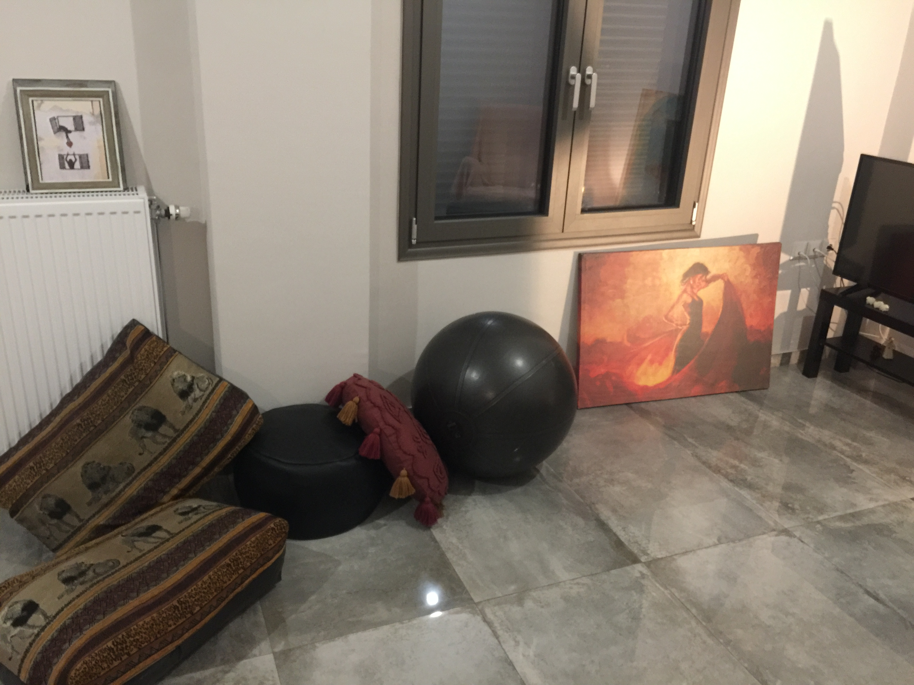

# **Evaluation of ORBSLAM2 using the Optitrack V120 Trio MoCap system**

The directory includes the results of the evaluation of the ORBSLAM2 algorithm using the Optitrack V120 Trio device. To evaluate the data we employed the scripts in the RealsenseRecorder **scripts/evaluation/ORBSLAM2** directory. The experimental setup is outlined in the following section.

## **Experimental Setup**

We use the Optitrack Mocap system to track the location of the robot and objects. It provides 6DoF pose measurements with 2mm accuracy at 120FPS. 

The robot used was a Xiaomi Mi robot vacuum, controlled with remote teleoperation, using a mobile phone. The picture below shows the setup of the Optitrack Trio, including the placement of the markers on the robot. 

  
   
   

Fig.1 - (left) The Optitrack Trio setup and (middle) Xaomi robot, integrated with optical markers (right) object tracking using the optical markers.

For each sequence, we control the robot remotely. We use a Realsense D455 camera mounted on top of the robot to  acquire RGB, Depth, Accelerometer and Gyroscope measurements at different framerates. The dataset includes different scene setups, including scenes with a lot of features, scenes with very low feature density or reflective materials. Some example are shown below:

  
   
   

Fig.2 - (left) Low feature sequence (middle) High feature sequence (right) reflective materials on floor.

We also change the lighting of the environment, to experiment with the tracking component of the VSLAM algorithm. The figures below show some example lighting conditions used:

  
   

Fig.3 - (left) some natural lighting (right) technical lighting only.

## **Moving Objects**
The dataset also includes sequences where objects move in the vicinity of the robot. We use the Optitrack Trio markers to track the pose of the object, relative to the Mocap frame. The figures below illustrate the setup:

  
   

Fig.4 - (left) the setup for tracking the robot and object position (right) moving the object while controlling the robot.

The strings are used as a way to move the object while also controlling the robot :).
We use different colors and sizes for the objects, as shown below:

  
   

Fig.5 - (left) red small object (right) black medium object.

## **Evaluation**
We use the scripts in the **scripts/evaluation/ORBSLAM2** directory to evaluate the data sequences. Currently, there are two folders. The first includes data sequences with static scenes and is located in the **Results/Static** folder. These can be used as a benchmark for the VSLAM system. Some example evaluations are shown below:

  
   
 

 

Fig.6 - The evaluation of different trajectories in static environments.

The second includes scenes with moving objects, which are more challenging for ORBSLAM2. In these sequences, the ground truth file also includes the XYZ position of the object in the scene. They are located in the **Results/MovingObjects** directory. Results are more messed up in here, and can definitely be improved. Some examples are below:

  
    
 

 

Fig.7 - The evaluation of different trajectories with moving objects.

